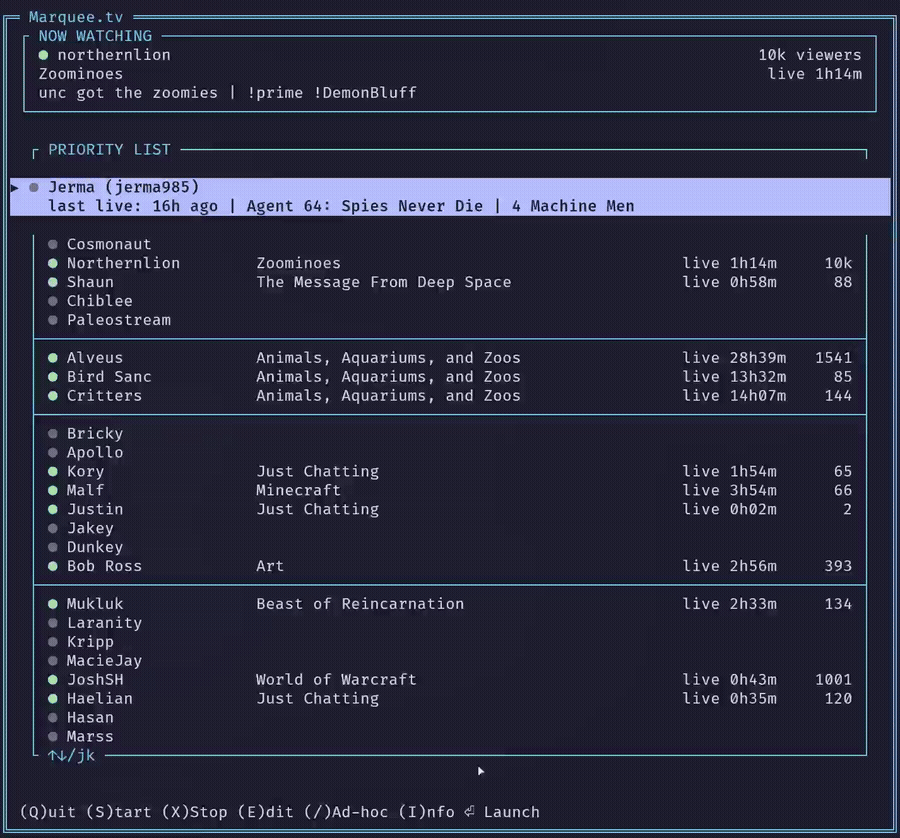

# Marquee.tv



A textual TUI that automatically launches your highest-priority live Twitch
stream and intelligently switches between streams based on your preferences —
plus ad-hoc stream watching, in-place priority-list editing, Chatterino tab
sync, and live MPV title updates.

## Features

- **Priority-based streaming**: define streamers in order of preference in
  `streamers.txt`; the daemon launches the highest-priority currently-live
  stream.
- **Intelligent auto-switching**: when a higher-priority stream goes live
  while you're watching something lower-priority, a desktop notification
  fires and the daemon waits a 5-minute grace period before auto-switching,
  so you can finish what you're watching.
- **Automatic fallback**: when the current stream ends, the daemon
  immediately launches the next highest-priority live stream.
- **Ad-hoc stream watching**: press `/` in the UI to watch any streamer, live
  or not in your priority list, in one of three modes — see below.
- **Edit priority list in-place**: press `e` in the UI to open
  `streamers.txt` in your editor; it reloads automatically on save/exit, no
  restart needed. The daemon also hot-reloads `streamers.txt` on its own if
  you edit it outside the UI.
- **Info overlay**: press `i` to see the full, untruncated stream title plus
  the channel's bio, fetched from Twitch on demand.
- **Chatterino integration**: the daemon (and one-shot streams) automatically
  bring Chatterino to the right channel's tab whenever the stream changes.
  This is currently done by closing and relaunching Chatterino (it restores
  its tabs on startup), rather than a seamless in-place tab switch.
- **Live MPV window title updates**: the mpv window's title bar updates
  automatically if the streamer changes game/category or retitles mid-stream,
  without restarting playback.
- **Low-latency streaming**: uses Twitch low-latency streamlink settings.
- **Desktop notifications**: `notify-send` notifications for upcoming
  auto-switches.

## Requirements

- `streamlink` - Stream launcher
- `mpv` - Video player
- `chatterino` - Twitch chat client
- Twitch CLI (`twitch`) - For checking live streams and channel info
- Python 3 with a virtualenv (the Textual UI needs `textual==8.2.8` — see
  Setup below)
- `jq` - For pretty-printing `marquee.sh status` output (optional, falls back
  to raw JSON)
- `notify-send` - For desktop notifications

## Setup

### 1. Configure your priority list

`streamers.txt` holds your priority list. You don't need to edit it before
first launch — once the UI is running, press `e` to open it in your editor
right from inside the TUI (see Usage below). Or edit it directly:

```
# Marquee.tv Priority List
northernlion
strippin|Strip
kruzadar
malf
```

Comments (lines starting with `#`) are ignored. One streamer per line, in the
order you want to watch them. Append `|Nickname` after a username to give it
a display name in the UI (the underlying Twitch login is still used for API
calls and launching — only the display changes).

### 2. Authenticate with Twitch CLI

The daemon and UI use the Twitch CLI to check which of your followed
streamers are live (and, for ad-hoc streams, to look up any channel). Make
sure you're authenticated:

```bash
twitch auth login
```

### 3. Set up the Python environment

The UI is built on [Textual](https://textual.textualize.io/). Create a venv
and install it:

```bash
python3 -m venv .venv
.venv/bin/pip install -r requirements.txt
```

`marquee.sh` and `marquee_ui.py` expect to find Textual in `.venv` (or
whatever interpreter their shebang resolves to) — make sure this step is done
before first launch.

## Usage

### Interactive TUI (recommended)

```bash
# Launch the interactive terminal UI
marquee.sh

# Or explicitly:
marquee.sh ui
```

The TUI is a single bordered "Marquee.tv" window containing:

- **NOW WATCHING** box — streamer name, live/offline indicator, viewer
  count, category, uptime, and stream title for whatever's currently
  playing. Shows "No stream active" when idle. The box's border label reads
  `NOW WATCHING (ad-hoc · override|temporary)` while an Override or
  Temporary ad-hoc stream is playing in this box, so you can always tell at
  a glance whether you're on your normal priority-list rotation or
  something else. (One-Shot streams play in a completely separate mpv
  window, so this box and its label are unaffected — see below.)
- **PRIORITY LIST** box — every streamer from `streamers.txt`, in order,
  with live/offline status, category, and viewer count. The highlighted row
  expands to show the full title + uptime (if live) or `last live: <relative
  time>` (if offline, from `.last_seen.json`).
- A footer with the current hotkey glossary — the keybindings are all shown
  right there as soon as you launch the UI.

### Ad-hoc stream watching

Press `/` in the UI. The NOW WATCHING box turns into a text field — type any
Twitch username (it does not need to be in your priority list) and press
`Enter`. You'll then be prompted to pick a mode:

- **`O` — Override**: switches to this stream now and pins it. The daemon's
  normal auto-switch logic is suppressed entirely while pinned — it won't
  jump away even if a higher-priority stream goes live. The pin clears the
  next time you switch to anything else (from the list or another ad-hoc
  request).
- **`T` — Temporary**: switches to this stream now, but normal
  priority-list auto-switching behavior still applies — if a priority-list
  streamer you'd normally watch goes live, the usual grace-period switch will
  still happen.
- **`1` — One-Shot**: opens a completely separate mpv window for this
  streamer, entirely untracked by the daemon. Your normal priority-list
  stream (and Chatterino) keeps running untouched in the background, and the
  NOW WATCHING box keeps showing that normal stream unchanged — it does
  *not* relabel itself as ad-hoc, since the one-shot stream lives in its
  own window (identified by its own mpv title bar). Closing the one-shot
  mpv window just ends that one-shot session.

Override and Temporary both go through the daemon's normal `.control`
protocol; One-Shot is handled entirely inside the UI process.

### Editing the priority list

Press `e`. The TUI suspends and opens `streamers.txt` in `$EDITOR` (defaults
to `nvim` if unset). Save and quit the editor to return to the TUI — the list
reloads automatically, no restart needed. This works whether or not the
daemon is running; the daemon also independently hot-reloads `streamers.txt`
if you edit it some other way (e.g. directly, outside the UI) while it's
running.

### Info overlay

Press `i` while watching a stream to see its full, untruncated title and the
channel's bio (Twitch's `description` field — this is the channel's static
"About" text, not a per-stream description, so it won't change between
streams). The bio is fetched fresh from Twitch each time you open the
overlay, not cached or polled in the background. Press `i` again to close it.

### Command-line control

```bash
# Start the daemon (runs in background)
marquee.sh start

# Check current status
marquee.sh status

# Stop the daemon
marquee.sh stop

# Run the daemon in the foreground (for debugging/testing)
marquee.sh watch

# Follow the daemon log
marquee.sh log

# Force an immediate switch to the highest-priority live stream
# (legacy — the UI's Enter-to-launch supersedes this for most use)
marquee.sh now
```

### During a stream

When a higher-priority stream goes online while you're watching something
else:
1. A desktop notification appears.
2. The TUI's live-status row shows it as live immediately.
3. The daemon auto-switches after a 5-minute grace period, unless you're in
   Override mode (see Ad-hoc above) or you switch manually first.
4. If you close mpv, the daemon immediately switches to the next
   highest-priority live stream.

When your current stream ends, the daemon automatically launches the next
highest-priority live stream.

## Configuration

These live as constants near the top of `marquee_daemon.py`:

```python
CHECK_INTERVAL = 10       # seconds between control-signal/reload checks
API_UPDATE_INTERVAL = 60  # seconds between Twitch API polls
GRACE_PERIOD = 300        # seconds (5 minutes) before auto-switching
```

Streamlink/mpv player settings (quality, volume, low-latency flags) are set
in the `player_args`/`cmd` construction inside `launch_stream()` in
`marquee_daemon.py` (and mirrored in `spawn_one_shot()` in `marquee_ui.py`
for one-shot streams).

## Files

- `marquee_daemon.py` - background daemon: polling, auto-switch logic,
  stream launching, Chatterino sync, live title updates
- `marquee_ui.py` - Textual-based interactive TUI
- `marquee.sh` - control script / entry point (`ui`, `start`, `stop`,
  `status`, `now`, `watch`, `log`)
- `marquee.service` - systemd user unit for running the daemon standalone
- `streamers.txt` - priority list (edit this, or press `e` in the UI!)
- `marquee_model.py`, `marquee_render.py`, `mpv_ipc.py`, `priority_list.py`,
  `ui_format.py` - shared/internal modules (UI state machines, pure line
  rendering, MPV JSON-IPC helper, streamers.txt parsing, formatting helpers)
  used by both the daemon and the UI
- `requirements.txt`, `pyproject.toml` - Python dependencies and pytest
  config; `.venv/` - local virtualenv (create with the Setup steps above)
- `tests/` - pytest test suite
- `.status.json` - current status, written by the daemon (auto-generated)
- `.last_seen.json` - last-confirmed-live timestamps per streamer
  (auto-generated)
- `.control` - control file for UI→daemon signals (auto-generated,
  transient)
- `.log` - daemon log file, written by `marquee.sh start` (auto-generated)

## Tips

- **Add an alias** to your `.zshrc` or `.bashrc`:
  ```bash
  alias marquee='/path/to/marquee.sh'
  ```

- **Auto-start on login** (systemd user service): a template unit is
  checked in as `marquee.service` — edit the two `/path/to/marquee-tv`
  placeholders in it to match wherever you cloned this repo, then copy it
  into `~/.config/systemd/user/` and enable it:
  ```bash
  mkdir -p ~/.config/systemd/user
  cp marquee.service ~/.config/systemd/user/
  systemctl --user enable marquee
  systemctl --user start marquee
  ```

- **Window placement on a second monitor**: if you use Chatterino alongside
  Marquee.tv, it's worth setting up window rules in your desktop environment
  so mpv and Chatterino automatically land next to each other on your
  second monitor every time a stream switches, instead of having to move
  them by hand. On KDE Plasma, this is System Settings → Window Management
  → Window Rules — add a rule matching each app's window class/title with a
  fixed position and size.

## License

Freely modifiable for personal use.
